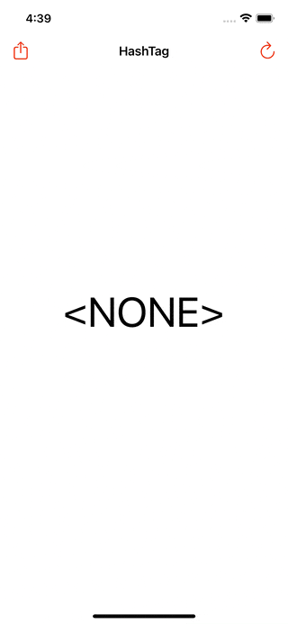
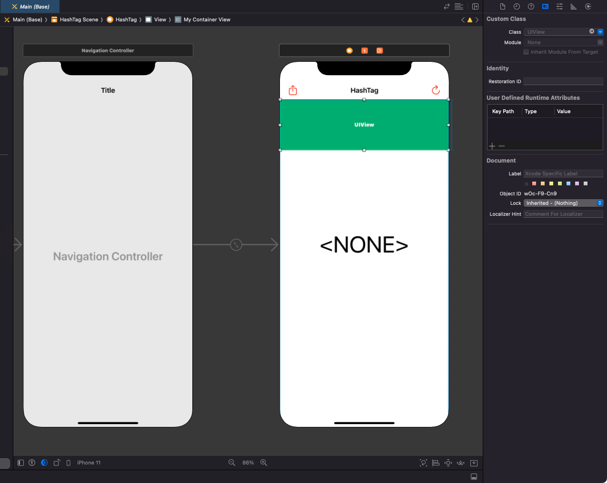

# WWHashTagViewController

[](https://developer.apple.com/swift/) [](https://developer.apple.com/swift/)  [](https://developer.apple.com/swift/) [](https://developer.apple.com/swift/)

## [Introduction - 簡介](https://swiftpackageindex.com/William-Weng)
- [Simple hashtag functionality, menu of applicable product options.](https://blog.vizdata.tw/2018/02/how-to_26.html)
- [簡單的hashtag功能，適用產品選項的選單。](https://likeabossapp.com/2018/11/11/客製-uicollectionviewflowlayout-讓-uicollectionview-靠左對齊/?fbclid=IwAR1m6uQdbswbe3vllzGM--wP3HKKdFPFxBT7S0MgdgYCL65ac77vWT495Rk)



### [Installation with Swift Package Manager](https://medium.com/彼得潘的-swift-ios-app-開發問題解答集/使用-spm-安裝第三方套件-xcode-11-新功能-2c4ffcf85b4b)
```
dependencies: [
    .package(url: "https://github.com/William-Weng/WWHashTagViewController.git", .upToNextMajor(from: "1.1.0"))
]
```



## [Function - 可用函式](https://gitbook.swiftgg.team/swift/swift-jiao-cheng)
|函式|功能|
|-|-|
|reloadData()|重新讀取Items|

## WWHashTagViewControllerDelegate
|函式|功能|
|-|-|
|number(_:)|Item的數量|
|layoutType(_:)|Layout的方式|
|hashTagViewController(_:viewForItemAt:)|產生要加上Cell上的自訂View|
|hashTagViewController(_:collectionView:didSelectItemAt:)|被點到時的反應|

## Example
```swift
import UIKit
import WWHashTagViewController

final class ViewController: UIViewController {

    @IBOutlet weak var myContainerView: UIView!
    @IBOutlet weak var heightConstraint: NSLayoutConstraint!
    @IBOutlet weak var myLabel: UILabel!
    
    private let height = 125.0
    
    private var isOn = false
    private var count = 0
    private var productName = "iPhone"
    private var selectedItems: Set<IndexPath> = []
    private var hashTagViewController: WWHashTagViewController!
    
    override func viewDidLoad() {
        super.viewDidLoad()
        initSetting()
    }
    
    @IBAction func refresh(_ sender: UIBarButtonItem) {
        refreshAction()
    }
        
    @IBAction func changeConstraint(_ sender: UIBarButtonItem) {
        changeConstraintAction()
    }
}

extension ViewController: WWHashTagViewControllerDelegate {
    
    func number(_ hashTagViewController: WWHashTagViewController) -> Int {
        return count
    }
    
    func layoutType(_ hashTagViewController: WWHashTagViewController) -> WWHashTagViewController.CollectionViewLayoutType {
        return .default(type: .vertical(count: 3), itemHeight: 56, minimumLineSpacing: 5)
    }
    
    func hashTagViewController(_ hashTagViewController: WWHashTagViewController, viewForItemAt indexPath: IndexPath) -> UIView {
        
        let cellView = CellView(frame: .zero)
        cellViewSetting(cellView, indexPath: indexPath)
        
        return cellView
    }
    
    func hashTagViewController(_ hashTagViewController: WWHashTagViewController, collectionView: UICollectionView, didSelectItemAt indexPath: IndexPath) {
        
        guard let cell = collectionView.cellForItem(at: indexPath) as? WWHashTagViewControllerCell,
              let cellView = cell.subviews.last as? CellView
        else {
            return
        }
        
        cellViewAction(cellView, indexPath: indexPath)
    }
}

private extension ViewController {
    
    func initSetting() {
        
        heightConstraint.constant = 0
        count = 3
        
        hashTagViewController = WWHashTagViewController.build()
        hashTagViewController.delegate = self
        hashTagViewController._transparent()
        
        myContainerView._changeViewController(parent: self, to: hashTagViewController)
    }
    
    func refreashAction() {
        productName = (productName == "iPhone") ? "iPad" : "iPhone"
        count = count * 2
        hashTagViewController.reloadData()
    }
    
    func changeConstraintAction() {
        
        defer {
            
            if (isOn) { self.hashTagViewController.reloadData() }
            
            UIView.animate(withDuration: 0.25) {
                self.view.layoutIfNeeded()
            } completion: { _ in
                if (!self.isOn) { self.hashTagViewController.reloadData() }
            }
        }
        
        isOn.toggle()
        if (!isOn) { count = 0; heightConstraint.constant = 0; return }
        
        count = 5
        heightConstraint.constant = height
    }
    
    func cellViewSetting(_ cellView: CellView, indexPath: IndexPath) {
        
        cellView.myLabel.text = "\(indexPath.row)"
        
        if (selectedItems.contains(indexPath)) {
            cellView.contentView.backgroundColor = .red
            cellView.myLabel.textColor = .white
        } else {
            cellView.contentView.backgroundColor = .systemGray3
            cellView.myLabel.textColor = .black
        }
    }
    
    func cellViewAction(_ cellView: CellView, indexPath: IndexPath) {
        
        cellView.myLabel.text = "\(indexPath.row)"
        
        if (!selectedItems.contains(indexPath)) {
            selectedItems.insert(indexPath)
            cellView.contentView.backgroundColor = .red
            cellView.myLabel.textColor = .white
        } else {
            selectedItems.remove(indexPath)
            cellView.contentView.backgroundColor = .systemGray3
            cellView.myLabel.textColor = .black
        }
    }
}
```
